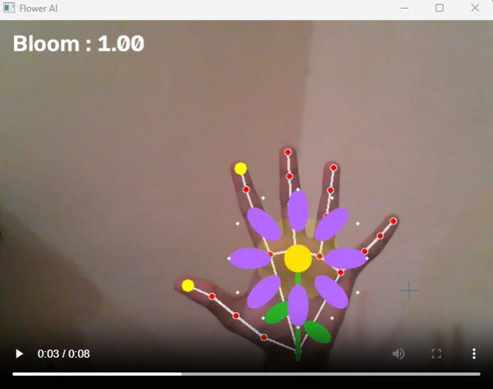

# 🌸 AI Flower Bloom

> **A real-time computer vision experiment where hand gestures control a blooming flower.**

AI Flower Bloom uses a webcam and **MediaPipe hand tracking** to transform a simple hand gesture into an interactive visual experience.

Bring your **thumb and index finger together or apart** and watch the flower respond in real time.

## 🎥 Demo


**[▶️ Watch the AI Flower Bloom Demo](./demo.mp4)**

## ✨ Features

* 🖐️ **Real-time hand tracking** using MediaPipe
* 📏 **Gesture measurement** using thumb-to-index distance
* 🌸 **Dynamic flower animation** based on hand movement
* ✨ **Smooth bloom transitions** using interpolation
* 💫 **Visual effects** including glow, petals and sparkles
* 🎥 **Live webcam interaction** using OpenCV

## 🧠 How It Works

The interaction follows a simple pipeline:

```text
        Webcam
           ↓
     OpenCV captures frame
           ↓
    MediaPipe detects hand
           ↓
  Extract thumb + index points
           ↓
  Calculate finger distance
           ↓
   Normalize → Bloom value
           ↓
     Animate the flower
```

The distance between the thumb and index finger is converted into a value between **0 and 1**, which controls the flower's bloom.

A smoothing factor is also applied so the animation feels natural instead of jumping between positions.

## 🛠️ Tech Stack

| Technology  | Purpose                       |
| ----------- | ----------------------------- |
| 🐍 Python   | Core programming              |
| 👁️ OpenCV  | Webcam input & graphics       |
| ✋ MediaPipe | Hand landmark detection       |
| 📐 Math     | Gesture distance calculations |

## 📁 Project Structure

```text
ai-flower-bloom/
│
├── main.py             # Application entry point
├── hand_tracker.py     # Hand detection & gesture processing
├── flower.py           # Flower rendering & animation
├── requirements.txt    # Python dependencies
└── .gitignore          # Ignored files
```

## 🚀 Getting Started

### 1. Clone the repository

```bash
git clone https://github.com/Sayed-Ameen04/ai-flower-bloom.git
cd ai-flower-bloom
```

### 2. Create a virtual environment

```bash
python -m venv .venv
```

Activate it on Windows:

```bash
.venv\Scripts\activate
```

### 3. Install dependencies

```bash
pip install -r requirements.txt
```

### 4. Run the project

```bash
python main.py
```

Make sure your computer has a working webcam.

Press **ESC** to close the application.

## 💡 What I Learned

Building this project helped me explore:

* Real-time computer vision pipelines
* MediaPipe hand landmarks
* Coordinate systems and normalized landmark positions
* Gesture-based interaction
* Distance-based feature mapping
* Smooth animation and interpolation
* Structuring a Python project into reusable modules

## 🔮 Future Ideas

* 🎨 Gesture-controlled flower colors
* 🌺 Multiple flower types
* ✋ More gesture interactions
* 🌄 Background segmentation
* ✨ More advanced particle effects
* 👥 Multi-hand interactions

---

### Built with Python, OpenCV & MediaPipe

**Experiment → Build → Learn → Improve 🚀**
